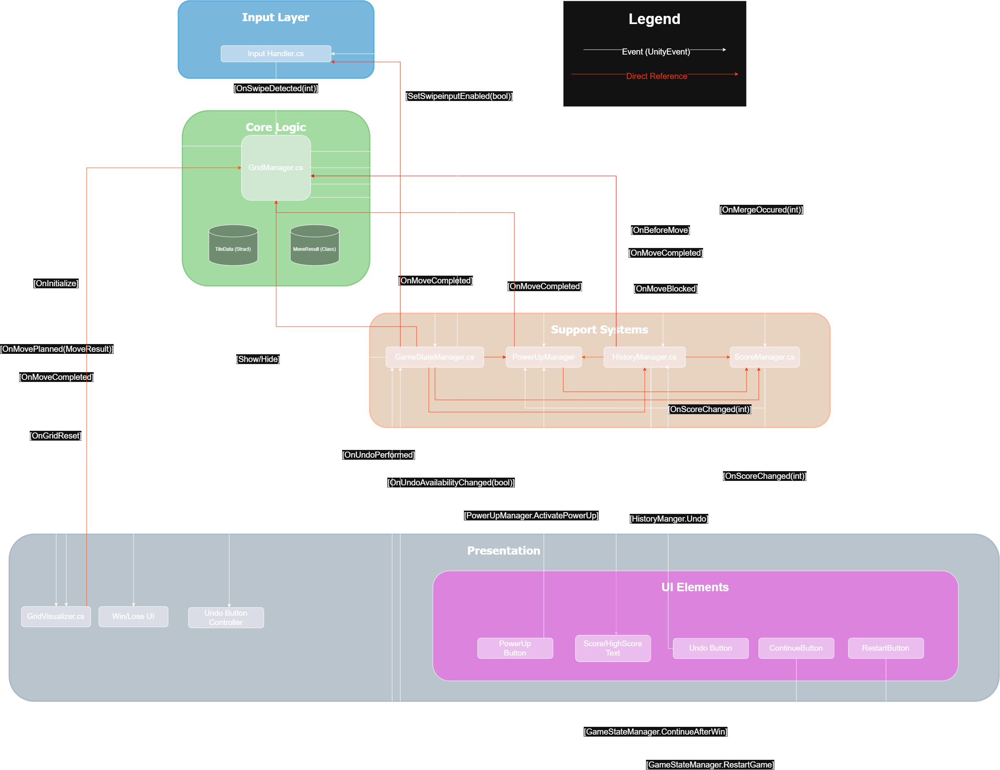
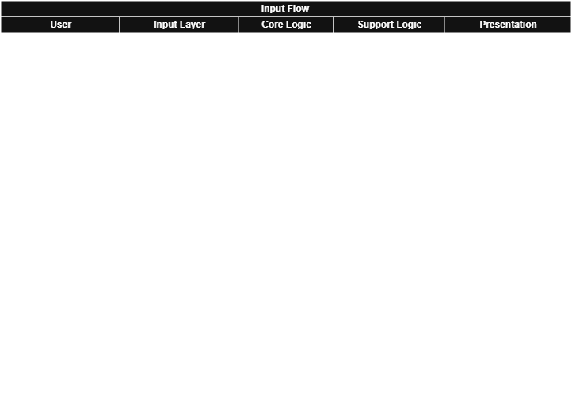

# GridPuzzleGame
A polished, grid-based mobile puzzle game built in Unity.

## 🎮 Play the Game

📱 **[Download the latest APK](../../releases/latest)**

**Requirements:** Android 7.0+, ARM64 device or emulator.

## System Architecture Map

## Functional Code Flow
A definitive lifecycle pipeline from raw user input to rendered output:

